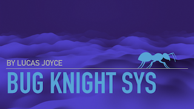

# Table of Contents.
> # 1. Introduction
>> ## *1.1* Purpose
>> A bug tracker is an essential tool for any software development team, as it helps document the life cycle of any bugs that are encountered throughout the development process. With a bug tracker, teams can detect, track, and monitor any bugs, defects, or other issues that arise, and then work to eliminate them.
>
>> ## *1.2* Scope
>> &nbsp;  *In Scope*  
>> &nbsp;  &nbsp; *1.* User Management: includes user registration, login, and profile management.  
>> &nbsp;  &nbsp; *2.* Bug Tracking: Enables users to report bugs, track progress, and prioritise bug reports.  
>> &nbsp;  &nbsp; *3.* Reporting: Generates reports on bugs, bug fixing progress, and user activity.  
>> &nbsp;  *Out Scope*  
>> &nbsp;  &nbsp;  *1.* Integration with other project management tools.  
>> &nbsp;  &nbsp;  *2.* Mobile app development for the bug tracking system.  
>> &nbsp;  &nbsp;  *3.* Automatic bug detection and fixing.  
>
>> ## *1.3* Objectives
>> &nbsp; &nbsp; *1.* To provide a user-friendly interface for reporting and tracking bugs.  
>> &nbsp; &nbsp; *2.* To streamline the bug fixing process and reduce the time taken to fix bugs.  
>> &nbsp; &nbsp; *3.* To prioritize bug reports based on severity and impact. 
>> &nbsp; &nbsp; *4.* To provide real-time updates on bug fixing progress to stakeholders.  
>> &nbsp; &nbsp; *5.* To generate reports on bugs, bug fixing progress, and user activity for better transparency and accountability.  
>
>> ## *1.4* Overview
>> Bug tracking is an exciting process of discovering and fixing errors in software! It's like a thrilling treasure hunt where developers are on a mission to uncover and remove any pesky bugs. Finding errors in complex software systems can be challenging, but it's also incredibly rewarding to see a project come to life after all the bugs have been eliminated. With the right bug tracking tools, teams can ensure that software is working as intended to provide a seamless user experience.

> # 2. System Features
>> ## *2.1* User Management
>> - - - -
>> 
>>> ### *2.1.1* User Registration
>>> - [ ] &nbsp; &nbsp; *1.* Users should be able to register for the bug tracking system using their email address and password.  
>>> - [ ] &nbsp; &nbsp; *2.* Users should be able to provide their personal information such as name, company name, and job title during registration.  
>>> - [ ] &nbsp; &nbsp;  *3.* The system should validate the email address before allowing users to complete the registration process.  
>>> - [ ] &nbsp; &nbsp;  *4.* The system should send a confirmation email to users after successful registration.  
>>
>>> ### *2.1.2* User Login
>>> - [ ] &nbsp; &nbsp; *1.* Users should be able to log in to the bug tracking system using their email address and password. 
>>> - [ ] &nbsp; &nbsp; *2.* The system should provide an option for users to reset their password if they forget it. 
>>> - [ ] &nbsp; &nbsp; *3.* The system should use secure encrypted connections (e.g. SSL/TLS) for user login. 
>>
>>> ### *2.1.3* Profile Management
>>> - [ ] &nbsp; &nbsp; *1.*  Users should be able to view and edit their personal information and preferences. 
>>> - [ ] &nbsp; &nbsp; *2.*  Users should be able to change their password. 
>>> - [ ] &nbsp; &nbsp; *3.*  The system should allow administrators to manage user accounts, including enabling and disabling user accounts. 
>> 
>> ## *2.2* Content Management
>> - - - - 
>>> ### *2.2.1* Bug Report Management
>>> - [ ] &nbsp; &nbsp; *1.* Users should be able to create, view, edit, and delete bug reports. 
>>> - [ ] &nbsp; &nbsp; *2.* Bug reports should include a title, description, and attachments such as screenshots or log files. 
>>> - [ ] &nbsp; &nbsp; *3.* Users should be able to assign severity levels to bug reports. 
>>> - [ ] &nbsp; &nbsp; *4.* Users should be able to categorize bug reports by type, such as UI bugs, functionality bugs, performance bugs, etc. 
>>> - [ ] &nbsp; &nbsp; *5.* Users should be able to assign bug reports to developers for resolution. 
>>> - [ ] &nbsp; &nbsp; *6.* The system should provide a search function for finding specific bug reports. 
>>
>>> ### *2.2.2* Comment Management
>>> - [ ] &nbsp; &nbsp; *1.* Users should be able to add comments to bug reports for better collaboration and communication. 
>>> - [ ] &nbsp; &nbsp; *2.* Users should be able to edit and delete their own comments. 
>>> - [ ] &nbsp; &nbsp; *3.* The system should provide a notification system for users when a new comment is added to a bug report they are following. 
>>
>>> ### *2.2.3* Activity Log
>>> - [ ] &nbsp; &nbsp; *1.* The system should log all activities, such as bug report creation, updates, and deletions, for auditing and accountability purposes. 
>>> - [ ] &nbsp; &nbsp; *2.* The system should provide a search function for finding specific activities in the log. 
>>
>> ## *2.3* Media Management
>> - - - - 
>>> ### *2.3.1* Image Management
>>> - [ ] &nbsp; &nbsp; *1.* Users should be able to attach images to bug reports for better visualization and understanding of the bug. 
>>> - [ ] &nbsp; &nbsp; *2.* The system should automatically resize images to a suitable size for faster loading and to save storage space. 
>>> - [ ] &nbsp; &nbsp; *3.* The system should provide a preview function for users to view images before attaching them to bug reports. 
>>
>>> ### *2.3.2* Video Management
>>> - [ ] &nbsp; &nbsp; *1.* Users should be able to attach videos to bug reports for better visualization and understanding of the bug. 
>>> - [ ] &nbsp; &nbsp; *2.* The system should automatically compress videos to a suitable size for faster loading and to save storage space. 
>>> - [ ] &nbsp; &nbsp; *3.* The system should provide a preview function for users to view videos before attaching them to bug reports. 
>>

> # 3. System Design
>> ## *3.1* Architecture Diagram
>> - - - -
>>> ### *3.1.1* System Architecture
>>> - [ ] &nbsp; &nbsp; *1.* The bug tracking system should consist of a front-end user interface, a back-end database, and an API for communication between the two. 
>>> - [ ] &nbsp; &nbsp; *2.* The front-end user interface should be developed using HTML, CSS, and JavaScript. 
>>> - [ ] &nbsp; &nbsp; *3.* The back-end database should be developed using MySQL or a similar database management system. 
>>> - [ ] &nbsp; &nbsp; *4.* The API should be developed using RESTful API design principles. 
>>
>>> ### *3.1.2* Component Diagram
>>> - [ ] &nbsp; &nbsp; *1.* The bug tracking system should consist of the following components: 
>>>     - [ ] - Login page  
>>>     - [ ] - Dashboard  
>>>     - [ ] - Bug report management page  
>>>     - [ ] - Comment management page  
>>>     - [ ] - Activity log page  
>>>     - [ ] - User management page  
>>>     - [ ] - Media management page  
>>> - [ ] &nbsp; &nbsp; *2.* The components should interact with each other through the API. 
>>> - [ ] &nbsp; &nbsp; *3.* The components should be designed to be modular and scalable for future updates and expansions. 
>>
>> ## *3.2* Database Design
>> - - - -
>>> ### *3.2.1* Database Structure
>>> - [ ] &nbsp; &nbsp; *1.* The bug tracking system should use a relational database management system (RDBMS) such as MySQL.
>>> - [ ] &nbsp; &nbsp; *2.* The database should consist of the following tables:
>>>     - [ ] - Users
>>>     - [ ] - Bugs
>>>     - [ ] - Comments
>>>     - [ ] - Media
>>>     - [ ] - Activity Log
>>> - [ ] &nbsp; &nbsp; *3.* The tables should be designed to be modular and scalable for future updates and expansions.
>>
>>> ### *3.2.2* Tables and Fields
>>> - [ ] 
 
 *1.* Users Table 
 
 
>>>     - id (primary key) 
>>>     - name 
>>>     - email 
>>>     - password 
>>>     - role (administrator, developer, tester) 
>>>     - created_at 
>>>     - updated_at 
>>>     

>>>     

>>>
>>> - [ ] &nbsp; &nbsp; *2.* Bugs Table 
 

>>>     - id (primary key) 
>>>     - title 
>>>     - description 
>>>     - status (open, closed, in progress) 
>>>     - assigned_to (foreign key referencing the Users table) 
>>>     - created_at 
>>>     - updated_at 
>>>     

>>>     

>>> 
>>> - [ ] &nbsp; &nbsp; *3.* Comments Table 
 
 
>>>     - id (primary key) 
>>>     - bug_id (foreign key referencing the Bugs table) 
>>>     - user_id (foreign key referencing the Users table) 
>>>     - comment 
>>>     - created_at 
>>>     - updated_at 
>>>     

>>>     

>>>
>>> - [ ] &nbsp; &nbsp; *4.* Media Table 
 

>>>     - id (primary key) 
>>>     - bug_id (foreign key referencing the Bugs table) 
>>>     - type (image, video) 
>>>     - file_name 
>>>     - file_path 
>>>     - created_at 
>>>     - updated_at 
>>>     

>>>     

>>>
>>> - [ ] &nbsp; &nbsp; *5.* Activity Log Table 
 

>>>     - id (primary key) 
>>>     - user_id (foreign key referencing the Users table) 
>>>     - bug_id (foreign key referencing the Bugs table) 
>>>     - action (create, update, delete) 
>>>     - created_at 
>>>     

>>>     

>>

 # Product Description
> ## Product Perspective
> A good bug report should be concise yet informationally dense, and should only contain one bug. In addition, it should include details of the environment and user steps that would allow the developer to reproduce the bug on their own. Reproducing the bug is essential to debugging, as it ensures the developer is not stumbling in the dark. By providing this information, teams can ensure their bug reports are as effective as possible.
> ## Product Feature
> A user-friendly interface is essential for a successful bug tracker, and should include customizable fields for gathering pertinent information about the bug. 
> These fields can include text, drop-down lists, checkboxes and more, allowing users to easily input the bug environment, module, severity, and other important details. 
> By having these fields available, users can ensure their bug reports are as effective as possible and can be easily tracked and monitored.
> ### User Types
> Bug tracking is a collaborative process, and should involve multiple user types. 
> Normal users can log a bug, while the team decides which bugs should be in scope for the project, which should go into the main backlog, and which should be addressed during the next iteration, sprint, or cycle. 
> By involving multiple user types, teams can ensure that the bug tracking process is as efficient and effective as possible, leading to the highest quality of products.
> ### Contraints
> Required fields for the bug report.  
> Note that the required fields of the bug report are:   
>  &nbsp;  &nbsp;  **Bug Summary**,   
>  &nbsp;  &nbsp;  **Severity**,   
>  &nbsp;  &nbsp;  **Steps to reproduce**,   
>  &nbsp;  &nbsp;  **Actual Result**, 
>  &nbsp;  &nbsp;  **Expected Result**. 
>
> ## Assumptions
> It helps testers function better, easily report and fix bugs.  
> Testers can view and utilize all the information required to resolve issues,  
> which enables faster development, verification, and releases of updated versions or even,  
> feature fixes. Faster releases make happier customers.
> ## Risks
> Complications can arise out of confusion over descriptions, lack of information, tools that  
> are overly cumbersome and require mandatory fields for which the user doesn't have the answers,  
> and difficulty in reporting.

 # System Feature
> ## Function Requirements
>> 
>> 
>> 
>> 
>> 
>> ### NOTE: this will update regularly. 
> ## External Interface Requirements
>> ### User Interface
>>>
>> ### Software Interface
>>> use the visual studio
>> ### Hareware Interface
>>> basic computer with internet 
>> ### Comunication Interface
>>> apis 

> ## System Requirements
>> ### Operating System
>> ### Processor
>> ### Ram
>> ### Browser
>> ### Devices

> ## Non-Function Requirements
>> ### Performance
>> ### Security
>> ### Scalability
>> ### Compatibility

> ## Models
>> ### Process Models
>> ### Function Decomposition
>> ### Use Case
>> ### Data Flow Diagram
>> ### Sequence Diagram
>> ### Entity Relationship Diagram

> ## Appendices and Credits
>> SRS - https://www.youtube.com/watch?v=rhXfrscZ_tM   
>> MVP - https://blackboxofpm.com/mvpm-minimum-viable-product-manager-e1aeb8dd421   
>>
